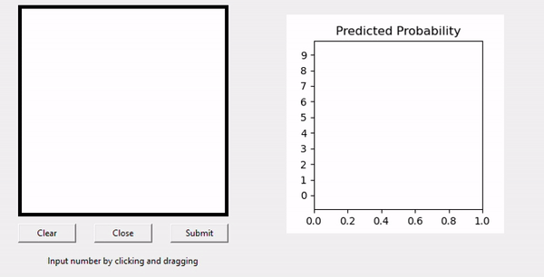

# realtime-digit-predictor
A GUI that predicts user input digits in realtime using a Tensorflow/Keras model. 

I trained this model using the well-known MNIST handwritten digits dataset with the use of Google Colab (yay free GPU resources!). This repo contains the code to create a tkinter GUI to access this model and make predictions in realtime.